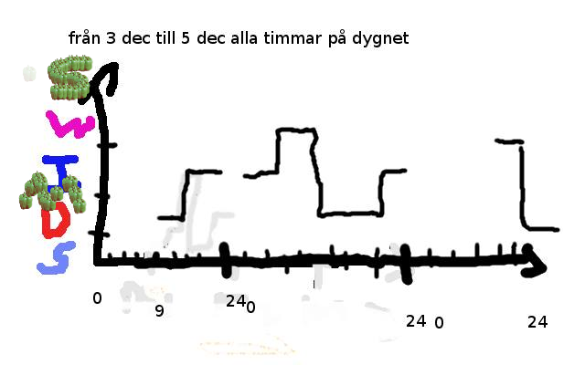

# Road Condition Monitoring RCM
##### Also known as SWIMDS Project
###### FYI I didn't write the frontend #dontjudge


## Requirements

Debian/Ubuntu
```
apt-get update
apt-get install git docker
```

Fedora/CentOS/Redhat
```
yum/dnf clean all
yum/dnf install git docker
```


## Installation
```
git clone https://github.com/kitzin/Road-Condition-Monitoring
cd Road-Condition-Monitoring && ./deploy
```

## Development installation
```
git clone https://github.com/kitzin/Road-Condition-Monitoring
cd Road-Condition-Monitoring && ./deploy-dev
```

In development deployment the Git directory will be linked into the container so any changes in this directory will be changed automagiclly in the container.
Anything changed in the frontend will not require a restart of the app. 
If you change anything in the backend, you will have to restart the app via docker.
To restart the container run `docker restart rcm-web` in your terminal.

## Error
Here are some errors that might happen.
#### Database pull
If the database extration to elasticsearch fails, the run `docker start -a rcm-pull`.

## Restart Application
```
docker restart rcm-web
```


###### Build by Emil Kitti, Rasmus Hartman, Tobias Axelsson, Oscar Saándström, Anton Lundqvist and Johan Kannel.
